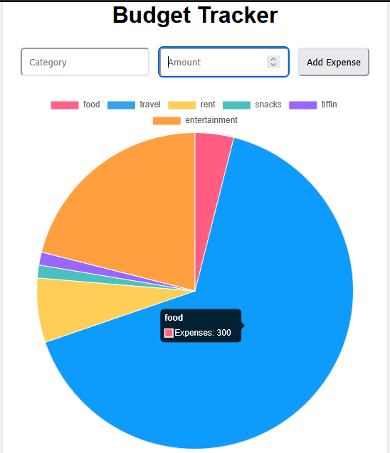

# Budget Tracker – Expense Pie Chart 🎯

This project is a simple budget tracker where you can enter expense categories and amounts, and view them visually as a pie chart using Chart.js.

## 🔧 Technologies Used
- HTML
- CSS
- JavaScript
- Chart.js

## 📸 Screenshot

## 📂 Setup
1. Clone the repo
2. Open `index.html` in a browser
